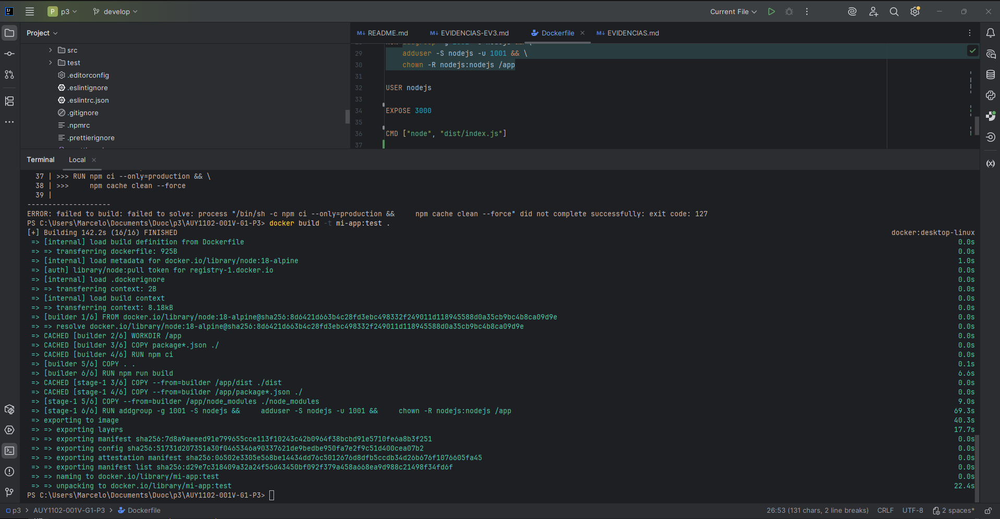
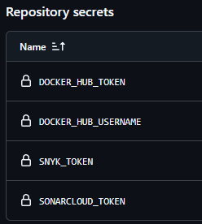
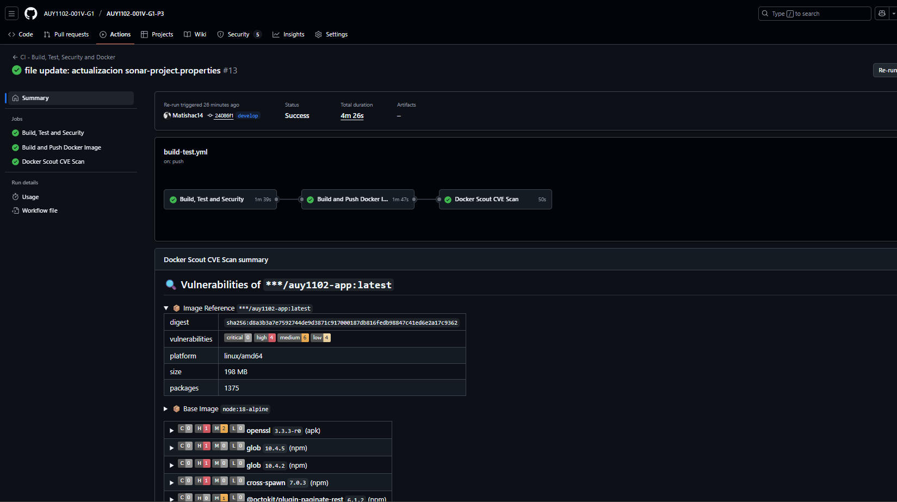
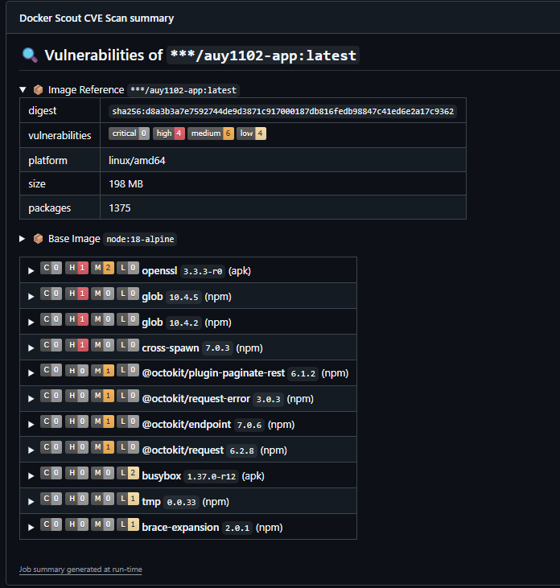
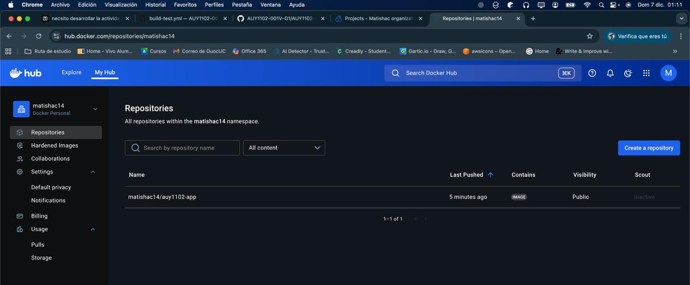
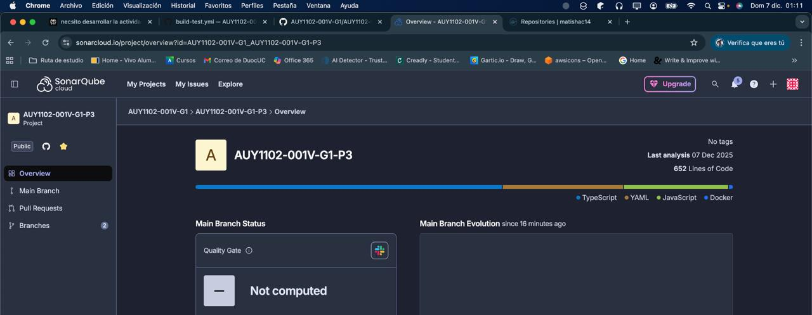
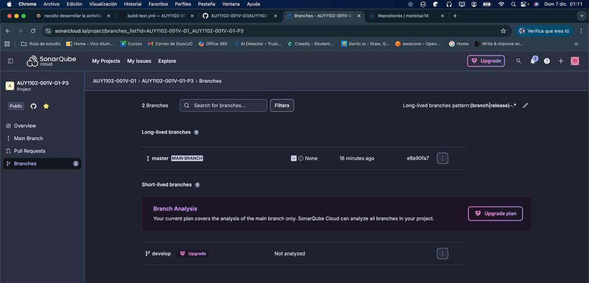

# Evaluación Parcial N°3 – CI/CD con GitHub Actions

Repositorio: AUY1102-001V-G1-P3  
Ramas: master (principal), develop (integración)

---

## 1. Flujo de trabajo

Fork del repo base del docente en la organización del grupo.  
Desarrollo en develop y merges hacia master mediante PR.  
GitHub Actions ejecuta:  
- Tests  
- Análisis de seguridad  
- Build y publicación de imagen Docker  

---


## 2. Docker

Dockerfile multi-stage con node:18-alpine y usuario no-root.  

Pruebas locales:  

```
npm ci
npm run build
docker build -t auy1102-app:local .
```
### Prueba local Docker


### Prueba local NPM


---

## 3. CI/CD – .github/workflows/build-test.yml

Disparadores:  
```
on:
  push:
    branches: [develop, master]
  pull_request:
    branches: [master]
```

Jobs principales: **build-test-security**  
```
- checkout + setup-node@v4 (Node 18)
- run: npm ci
- run: npm run build
- run: npm run test:coverage # (usando jest.ci.config.js para ignorar 1 test del template)
```

**Snyk:**  
```
uses: snyk/actions/node@master
env:
  SNYK_TOKEN: ${{ secrets.SNYK_TOKEN }}
```

**SonarCloud:**  
```
uses: SonarSource/sonarqube-scan-action@v5.0.0
env:
  SONAR_TOKEN: ${{ secrets.SONARCLOUD_TOKEN }}
```

**docker-build-and-push** (solo si lo anterior pasa)  
```
- name: Login a Docker Hub
  uses: docker/login-action@v2
  with:
    username: ${{ secrets.DOCKER_HUB_USERNAME }}
    password: ${{ secrets.DOCKER_HUB_TOKEN }}

- name: Build & push
  uses: docker/build-push-action@v4
  with:
    context: .
    push: true
    tags: |
      ${{ secrets.DOCKER_HUB_USERNAME }}/auy1102-app:latest
      ${{ secrets.DOCKER_HUB_USERNAME }}/auy1102-app:${{ github.sha }}
```

**docker-scout**  
Escaneo de vulnerabilidades de la imagen con Docker Scout.  

Otros workflows:  
- **codeql.yml:** análisis estático.  
- **pull_request.yml:** lint + tests en PR hacia master.  

---
### CI/CD Build and test




### Vista de DockerHub




## 4. Secrets configurados

En *Settings → Secrets and variables → Actions*:  
- DOCKER_HUB_USERNAME  
- DOCKER_HUB_TOKEN (access token de Docker Hub)  
- SNYK_TOKEN (API token de Snyk)  
- SONARCLOUD_TOKEN (token de SonarCloud)
---
### Secretos almacenados


## 5. SonarCloud

Archivo `sonar-project.properties`:  
```
sonar.projectKey=AUY1102-001V-G1_AUY1102-001V-G1-P3
sonar.organization=auy1102-001v-g1
sonar.projectName=AUY1102-001V-G1-P3
sonar.sourceEncoding=UTF-8
sonar.sources=src
sonar.tests=test
sonar.javascript.lcov.reportPaths=coverage/lcov.info
```

Se desactivó *Automatic Analysis* en SonarCloud, usando solo el análisis vía CI.  

---





## 6. Ajuste de tests (Jest)

`jest.ci.config.js`:  
```
const baseConfig = require('./jest.config.js');

module.exports = {
  ...baseConfig,
  testPathIgnorePatterns: [
    '/node_modules/',
    'test/value-object/primitives/StringValueObject/isEmpty.test.ts',
  ],
};
```

`package.json`:  
```
"test:coverage": "jest --coverage --config=jest.ci.config.js"
```

